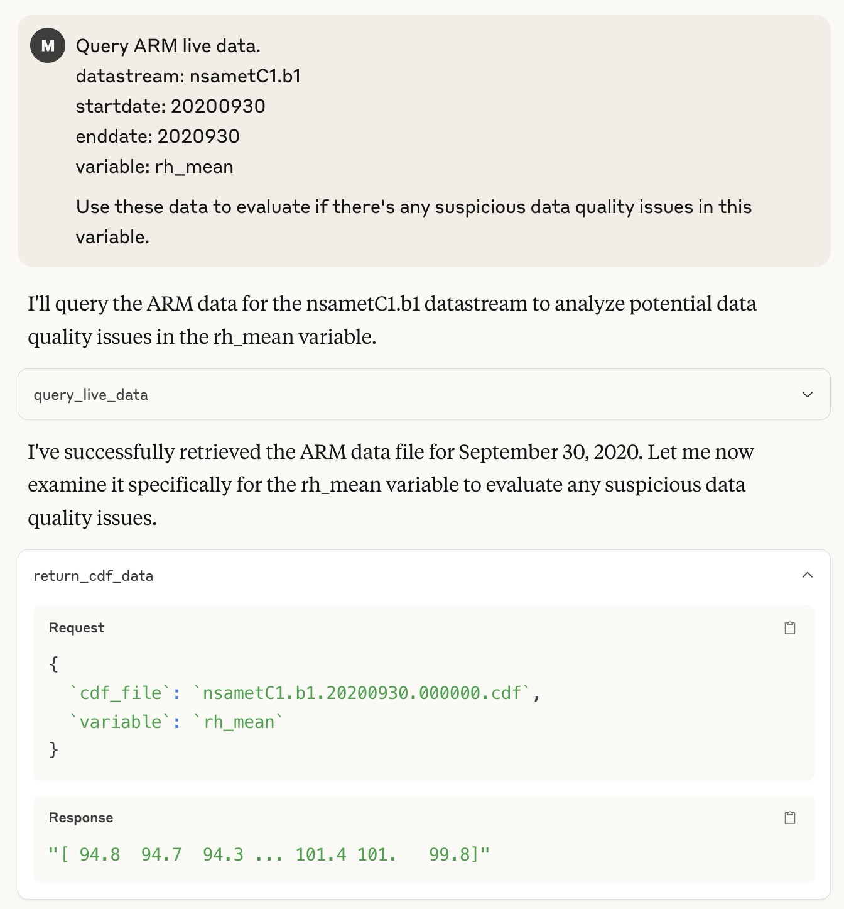

# MCP-ARM-Live-Data

# Evaluation of Data Quality Issues in the rh_mean Variable (Sept 30, 2020)

Based on my analysis of the relative humidity mean (rh_mean) data from the nsametC1.b1 datastream for September 30, 2020, I've identified several suspicious data quality issues that warrant attention.

## Key Findings

1. **Physically Impossible Values**
   - The data contains values exceeding 100% relative humidity (up to 101.4%)
   - Approximately 33.3% of the sampled values exceed 100% RH
   - From a physical perspective, relative humidity cannot exceed 100% under normal atmospheric conditions

2. **Quality Control Failures**
   - Despite these physically impossible values, all quality control flags (qc_rh_mean) are set to 0
   - This indicates the automated quality control system failed to identify these obvious anomalies

3. **Potential Sensor Issues**
   - The higher values (>100%) appear toward the end of the day
   - This pattern suggests possible sensor drift or calibration issues
   - The range of values (7.1%) is relatively wide, indicating variability that could be suspicious

4. **Environmental Context Considerations**
   - The data comes from the North Slope of Alaska (Barrow) in late September
   - Arctic environments present challenges for humidity sensors:
     - Frost formation on sensors
     - Condensation in high humidity conditions
     - Rapid temperature fluctuations

## Technical Assessment

The statistical analysis reveals:
- Minimum: 94.3%
- Maximum: 101.4%
- Mean: 97.67%
- Standard Deviation: 3.11%

The presence of values exceeding 100% RH is a clear indicator of sensor issues, as this is physically impossible under standard atmospheric conditions. While some specialized meteorological literature discusses "supersaturation" in specific contexts, instrument readings over 100% in standard meteorological stations typically indicate calibration problems, condensation on the sensor, or other technical issues.

## Recommendations

1. **Data Usage Caution**
   - Users of this data should treat RH values with skepticism, especially those exceeding 100%
   - Consider applying a correction factor or flagging values >100% as questionable

2. **Quality Control Review**
   - The automated QC system should be reviewed to ensure it properly flags physically impossible values
   - Consider implementing additional QC checks specifically for the 100% RH threshold

3. **Instrument Maintenance**
   - Check sensor calibration and potentially recalibrate
   - Ensure proper heating of the sensor to prevent condensation in high-humidity conditions

4. **Metadata Enhancement**
   - Update dataset documentation to note these issues for data users
   - Consider adding specific quality flags for supersaturation conditions

This evaluation highlights the importance of both automated and manual quality control processes in meteorological data, particularly for challenging measurement parameters like relative humidity in extreme environments.